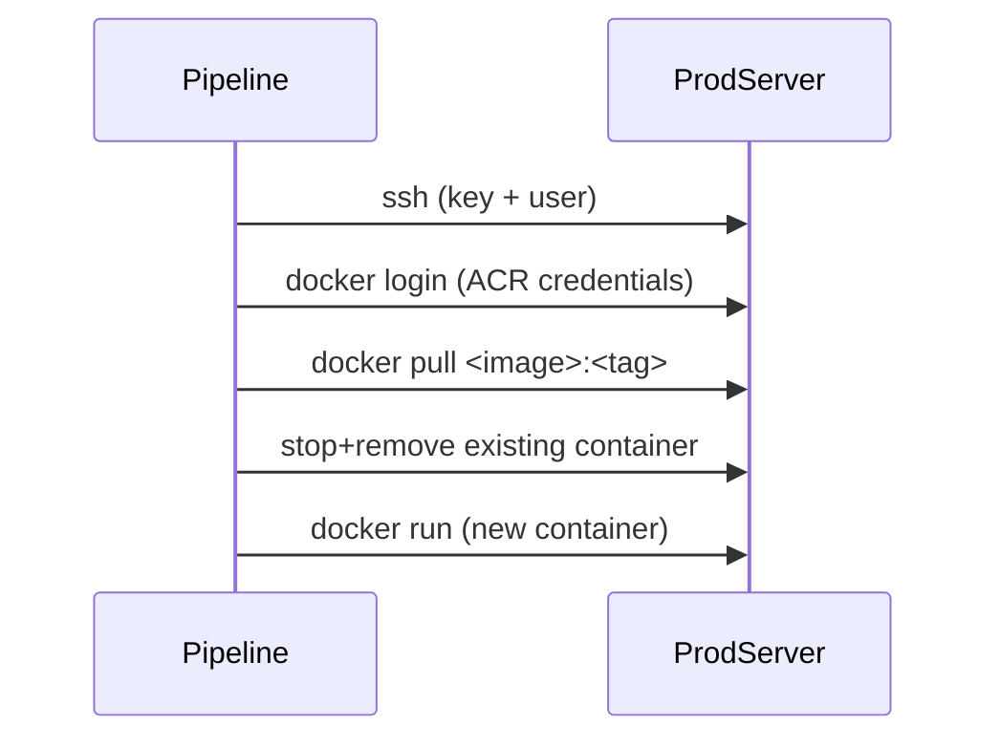

# ADO Docker Multistage Pipeline

This repository contains an Azure DevOps YAML pipeline that builds a Docker image from source, runs a quick smoke test, and deploys the image to both Azure Web Apps and a generic production server via SSH.

## Pipeline goals

- Build and push a Docker image to Azure Container Registry (ACR).
- Run a quick smoke test by pulling the image and running it locally in the pipeline.
- Deploy to a development Azure Web App.
- Deploy to production environments only after manual approval.
- Support semantic versioning via Git tags and optionally via manual trigger.
- Keep the deployment process cloud-agnostic by deploying to a configurable SSH-accessible server.

## How it works

### Trigger conditions

The pipeline triggers on:

- Pushes to `main`
- Git tags matching `v*` or `*.*.*`
- Pull requests against `main` (runs tests but will not deploy to production)

### Image tagging logic

The pipeline computes the final Docker tag as follows:

1. `ReleaseTag` (set by manually queuing the pipeline)
2. Git tag name when the build is triggered by a tag
3. `Build.BuildId` fallback

### High-level stage flow

```mermaid
flowchart TD
  A[Build & Push Image] --> B[Smoke Test]
  B --> C[Deploy to Dev (Azure Web App)]
  C --> D[Deploy to Prod (Azure Web App)]
  C --> E[Deploy to Prod Server]

  D ---|Manual approval gate| D
  E ---|Manual approval gate| E
```

### Production deployment (generic server)

For the production server deploy, the pipeline:

1. SSHes into a configured host using a secure key
2. Logs into ACR using provided credentials
3. Pulls the image from ACR
4. Stops any previous container for that image
5. Runs the new container



## Configuration variables

The pipeline relies on these variables (set in pipeline variables or variable groups):

- `IMAGE_REGISTRY_CONNECTION`: Azure DevOps service connection to ACR
- `IMAGE_REGISTRY`, `IMAGE_REPOSITORY`, `REGISTRY_URL`: image naming
- `AZURE_SUBSCRIPTION`, `DEV_WEBAPP_NAME`, `PROD_WEBAPP_NAME`: Azure Web App deployment
- `PROD_SERVER_IP`, `PROD_SSH_USER`, `PROD_SSH_KEY_FILE`: production server SSH deploy
- `ACR_USERNAME`, `ACR_PASSWORD`: credentials used for `docker login` on the production server

## Notes

- Production deploy stages will not run for pull request builds.
- Manual approval is required before any production deployment stage runs.
